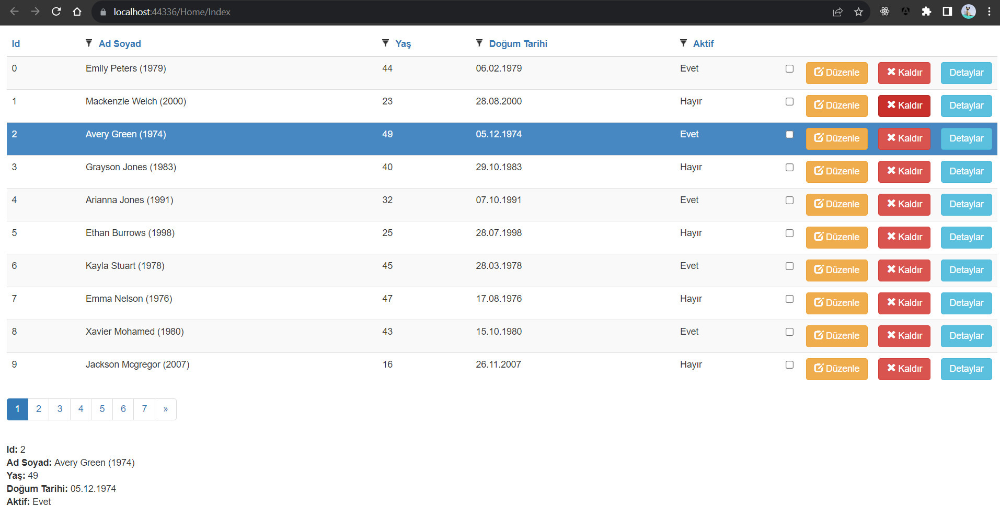

## Grid.Mvc
The grid control for ASP.NET MVC is an effective display engine for tabular data. A collection list pulls data from a data source, such as OData web services or DataManager, binds data fields to columns and displays a column header to identify the field.



### Used Packages for Grid_MVC

Packages can be installed from the "[NuGet Gallery](https://www.nuget.org/packages/Microsoft.AspNet.Identity.Core)" with the help of the `Tools > NuGet Package Manager > Package Manager Console`.

- [Grid.Mvc 3.0.0](https://www.nuget.org/packages/Grid.Mvc)
```
    PM> NuGet\Install-Package Grid.Mvc -Version 3.0.0
```
- [Grid.Mvc.DatePicker 1.0.0](https://www.nuget.org/packages/Grid.Mvc.DatePicker)
```
    PM> NuGet\Install-Package Grid.Mvc.DatePicker -Version 1.0.0
```
- [Grid.Mvc.Ajax 1.0.31](https://www.nuget.org/packages/Grid.Mvc.Ajax)
```
    PM> NuGet\Install-Package Grid.Mvc.Ajax -Version 1.0.31
```
- [jQuery 3.7.1](https://www.nuget.org/packages/jQuery)
```
    PM> NuGet\Install-Package jQuery -Version 3.7.1
```
- [bootstrap 3.3.5](https://www.nuget.org/packages/bootstrap/3.3.5)
```
    PM> NuGet\Install-Package bootstrap -Version 3.3.5
```
<br/>

- [FakeData 1.0.0](https://www.nuget.org/packages/FakeData) -> For Create Fake Data
```
    PM> NuGet\Install-Package Grid.Mvc.DatePicker -Version 1.0.0
```